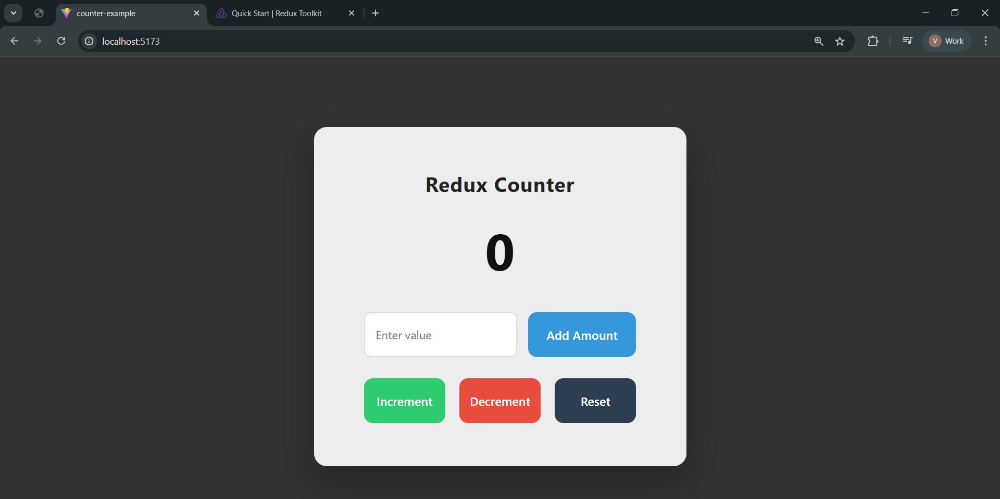

# 🧮 Redux Counter App

A simple Counter Application built using **React + Redux Toolkit**.
This project demonstrates how to manage global state using Redux Toolkit and dispatch actions to update UI.

---

## 📸 UI Preview



---

## 🚀 Features

- Increment counter
- Decrement counter
- Reset counter
- Add custom value to counter
- Global state management with Redux Toolkit
- Clean UI with responsive layout

---

## 🛠️ Tech Stack

- React.js
- Redux Toolkit
- React Redux
- CSS3

---

## 📁 Project Structure

```
src/
│
├── redux/
│   ├── store.js
│   └── features/
│       └── counterSlice.js
│
├── App.jsx
├── App.css
└── main.jsx
```

## 🧠 Redux Flow Used

1. User clicks button
2. Action dispatched using `dispatch()`
3. Reducer updates store state
4. UI re-renders automatically via `useSelector`

---

## 🎯 Learning Outcomes

- Understanding Redux Toolkit slices
- Using `configureStore`
- Dispatching actions
- Accessing state using `useSelector`
- Structuring scalable React apps
