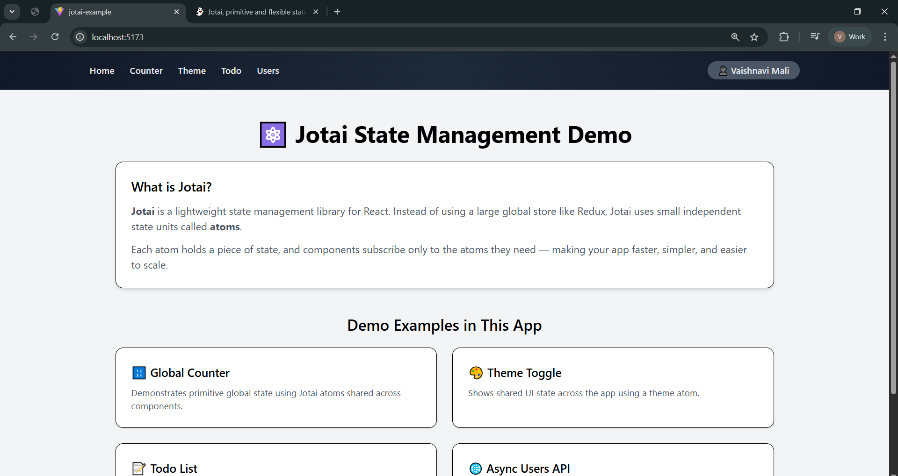

# ⚛️ Jotai State Management Demo (React + Tailwind)

This project demonstrates how to use **Jotai** for state management in a React application.
It includes multiple examples showing primitive state, shared UI state, async API data, array updates, derived state, and scoped stores.

---

## 📌 What is Jotai?

Jotai is a lightweight state management library for React.

Instead of managing one large global store (like Redux), Jotai uses **atoms** — small independent pieces of state.

Each atom can be used anywhere in the app, and components automatically re-render when the atom updates.

👉 This makes apps simpler, faster, and easier to scale.

---

## 📸 UI Preview

```

```

---

## 🚀 Features Demonstrated

This demo app includes:

- 🔢 **Global Counter**
  - Primitive atom shared across components

- 🎨 **Theme Toggle**
  - Shared UI state using a theme atom

- 📝 **Todo List**
  - Array state updates stored globally

- 🌐 **Users API (Async Atom)**
  - Fetching data globally using async atoms + Suspense

---

## 🛠️ Tech Stack

- React (Vite)
- Jotai
- React Router DOM
- Tailwind CSS

---

## 📂 Project Structure

```
src/
│
├── atoms/          # Global state atoms
├── components/     # Shared UI components
├── pages/          # Demo pages
├── App.jsx
└── main.jsx
```

---

## ▶️ How to Run Locally

1. Clone the repository

```
git clone <your-repo-link>
cd jotai-demo
```

2. Install dependencies

```
npm install
```

3. Start development server

```
npm run dev
```

---

## 🎯 What You Will Learn

By exploring this project, you will understand:

- How Jotai atoms replace global stores
- How multiple components share state
- How async atoms fetch API data
- How derived atoms compute values
- How Jotai differs from Redux, Context, and Zustand

---
