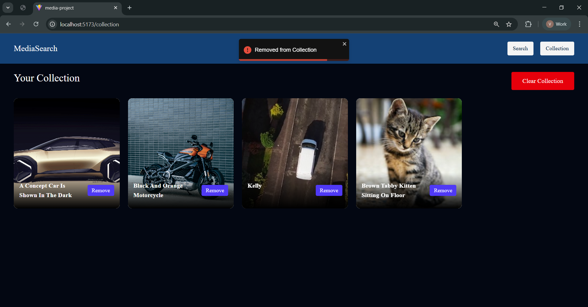

# 🎬 Media Explorer App

A modern media search application built using **React + Redux Toolkit** that allows users to search photos and videos, preview them, and save favorites.

This project demonstrates real-world state management, async API handling, and UI performance optimizations.

---

## 📸 UI Preview




---

## 🚀 Features

- 🔎 Search photos & videos from external APIs
- 🗂 Tabs to switch between media types
- ⚡ Debounced search to reduce API calls
- 🧠 Global state management using Redux Toolkit
- ⏳ Loading & error handling UI
- 💾 Save items to collection (favorites)
- 🖼 Responsive media grid layout
- 🎥 Video preview support
- 🎨 Modern UI with Tailwind CSS

---

## 🛠 Tech Stack

- React.js
- Redux Toolkit
- React Redux
- Tailwind CSS
- REST APIs (Unsplash / Pexels or similar)

---

## 📁 Project Structure

```
src/
│
├── api/
│   └── mediaApi.js
│
├── components/
│   ├── ResultGrid.jsx
│   ├── ResultCard.jsx
│   ├── Tabs.jsx
│   └── SearchBar.jsx
│
├── hooks/
│   └── useDebounce.js
│
├── redux/
│   ├── store.js
│   └── features/
│       └── searchSlice.js
│
├── App.jsx
└── main.jsx
```

---

## 🧠 Redux Flow Used

1. User types search query
2. Query stored in Redux store
3. Debounced query triggers API call
4. Results stored in Redux state
5. UI updates automatically

---

## 🎯 Learning Outcomes

This project helped practice:

- Redux Toolkit slices & store structure
- Async data fetching with API calls
- UI state vs global state handling
- Performance optimization (debounce, thumbnails)
- Component-based architecture

---

⭐ If you like this project, consider giving it a star!
